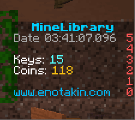
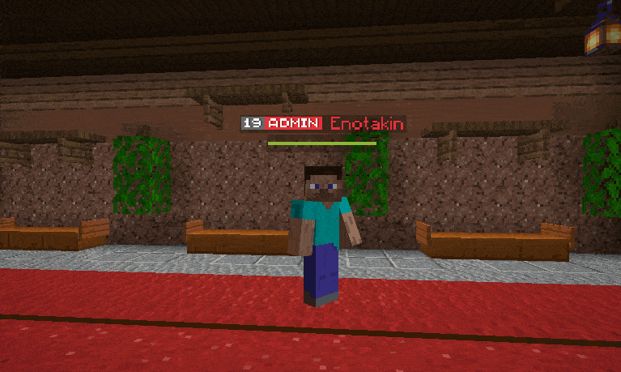

# MineLibrary
Library for Minecraft. Allows you to easily work with configs, create packet entities without using Bukkit and NMS.
Easy and understandable work with Scoreboard API, creation of entities on packets.

### Command API
<b>Usage:</b>
```
@Command("gamemode")
@Aliases({"gm"})
@Permission("minelibrary.command.gamemode")
public class GameModeCommand {

    @CommandHandler
    public void handle(CommandSender sender, @Argument GameMode gameMode) {
        Bukkit.getPlayerExact(sender.getName()).setGameMode(gameMode);
        sender.sendMessage(String.format("Game mode changed to %s.", gameMode.name()));
    }
}
```

```
MineAPI.registerCommand(this, new GameModeCommand());
```

### Entity API


<b>Supported entities:</b>
* Human
* ArmorStand
* Hologram
* Villager

<b>Features:</b>
* Aligning an NPC's body with respect to the direction of its head
* Glow effect support
* Skin support
* Equipment
* Interaction with entities
* Optimization and minimum load on the server
* Implementation without using Bukkit and NMS

<b>Usage:</b>
```
@EventHandler
public void onPlayerJoin(PlayerJoinEvent event) {
    Player player = event.getPlayer();
    Location location = player.getLocation();

    MineHologram hologram = MineAPI.spawnEntity(location, MineHologram.class);
    hologram.addLine(Component.text("Line 1"));
    hologram.addLine(Component.text("Line 2"));
    hologram.addLine(Component.text("Line 3"));
    hologram.addLine(new ItemStack(Material.IRON_SWORD));

    MineHuman human = MineAPI.spawnEntity(location, MineHuman.class);
    human.setGlowing(true);
    human.setGlowColor(ChatColor.GOLD);
    human.setSkin("Value", "Signature");
    human.setLookAtPlayer(true);
}
```

### Scoreboard API
This library is very similar in implementation and usage to Java Collections and is just as easy and straightforward to use.



<b>Features:</b>
* RGB and Component API support
* Supports all types: List, Sidebar, Below Name, Team
* No flickering with frequent updates
* Optimization and minimum load on the server
* Implementation without using Bukkit and NMS

<b>Usage:</b>
```
@EventHandler
public void onPlayerJoin(PlayerJoinEvent event) {
    Player player = event.getPlayer();

    Sidebar sidebar = new ScoreboardSidebar("sidebar", Component.text("DisplayName"));
    sidebar.setLine(3, Component.text("Line 3"));
    sidebar.setLine(2, Component.text("Line 2"));
    sidebar.setLine(1, Component.text("Line 1"));
    sidebar.setLine(0, Component.text("Line 0"));

    sidebar.showTo(player);
}
```
### Menu
To create a menu, you no longer need to forever register listeners, compare inventories and cancel inventory click events, just create a class, and it will work <b>WITHOUT REGISTRATION OF LISTENERS</b>

```
public class ExampleMenu implements Menu {

    private final Inventory inventory;

    public ExampleMenu() {
        inventory = Bukkit.createInventory(this, 6 * 9, Component.text("Example Menu"));
    }

    @Override
    public @NotNull Inventory getInventory() {
        return inventory;
    }

    @Override
    public void onOpen(Player player) {
        // Call when player open menu
    }

    @Override
    public void onClick(@Nullable ItemStack itemStack, Player player, int slot, ClickType type) {
        // Call when player click, some code...
    }

    @Override
    public void onClose(Player player) {
        // Call when player close menu
    }

}
```
### NameTag
Multi-line name tags above the player's head. Supports any number of lines, the movement of the lines is perfectly synchronized with the movements of the player. The code does not load the server and is implemented entirely on packets, without the use of Bukkit and NMS entities.



<b>Features:</b>
* RGB and Component API support
* Infinite number of lines above the head
* Synchronized movement with the player
* Optimization and minimum load on the server
* Implementation without using Bukkit and NMS

<b>Usage:</b>
```
@EventHandler
public void onPlayerJoin(PlayerJoinEvent event) {
    Player player = event.getPlayer();
    
    NameTag nameTag = MineAPI.createTag(player);
    nameTag.addLine(Component.text("Line 1"));
    nameTag.addLine(Component.text("Line 2"));
    nameTag.addLine(Component.text("Line 3"));
}
```
